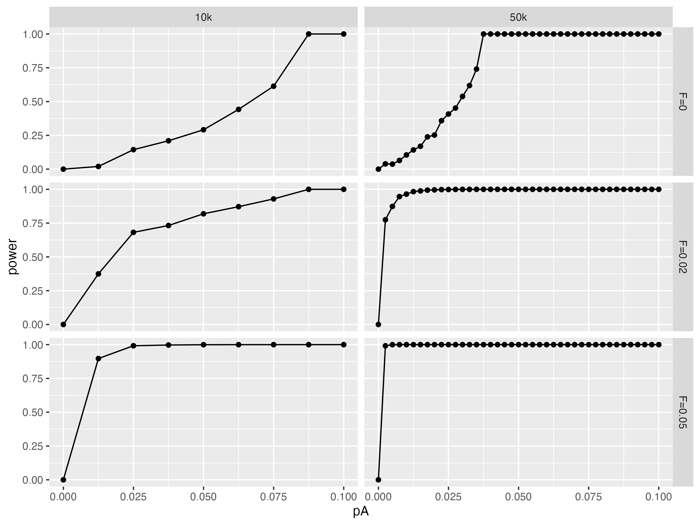

# Hardy-Weinberg Equilibrium Package

This R package provides tools for conducting exact tests under the Hardy-Weinberg Equilibrium (HWE) with adjustments for inbreeding, represented by the parameter theta. This is based on the work of [Wigginton](https://www.ncbi.nlm.nih.gov/pmc/articles/PMC1199378/) and [Weir](https://academic.oup.com/genetics/article/180/3/1609/6063905). 

## Installation
You can install the latest version of the package directly from GitHub:
```
# install.packages("devtools") # Uncomment if devtools is not installed
devtools::install_github("frhl/hardyr")
```

## Usage
Exact tests for the P-values can also be easily performed for large numbers:
```
library(hardyr)
N <- 100000
nA <- 1000  # minor allle count
nAB <- 990 # heterozygotes
hwe_exact_test(N, nA, nAB, theta = 4, alternative = "less")
```
The theta parameter can be changed with `calc_theta_from_f(pA, f)` to test for HWE after accounting for inbreeding. Power calculation can be done for various population structures and sizes. Here is an example getting power for a populations across the MAF spectrum:
```
library(hardyr)
library(ggplot2)

N_seq <- c(10000,50000)
f_seq <- c(0, 0.02, 0.05)
out <- do.call(rbind, lapply(f_seq, function(f){
  do.call(rbind, lapply(N_seq, function(N){
    nA_seq <- seq(0, (N*2)*0.1, by=250)
    do.call(rbind, lapply(nA_seq, function(nA){
      pA <- nA / (N * 2)
      theta <- calc_theta_from_f(pA, f)
      power <- hwe_exact_power(N, nA=nA, theta=theta, alternative="less", sig.level = 0.05)
      power_vec <- c(power_vec, power)
      data.table(N, pA, nA, f, power)
    }))
  }))
}))

# plot the results
out$N_label <- factor(to_thousands(out$N))
out$F_label <- factor(paste0("F=",out$f))
ggplot(out, aes(x=pA, y=power)) +
  geom_point() +
  geom_line() +
  facet_grid(F_label~N_label)
```




## License
This package is licensed under the MIT License - see the LICENSE file for details.


